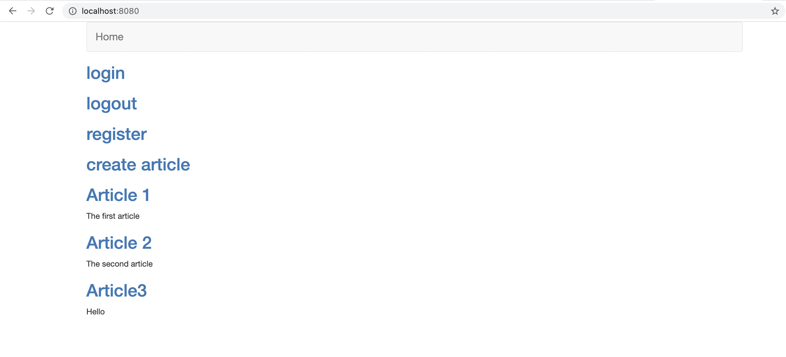

# SimpleWebServerv2
 A blog web server based on go
## Description
This project is a simple blog web server based on go. It allows user to register an account, login an account, logout an account, read articles and write new article in the login condition. This server also provide cookie to remember your login condition. Since this project is mainly focus on the server part, it's web page is simple and crude, sorry for the trouble.

The server store the account data and article data on a local mysql database. Based on gin, several microservices are built to accomplish the functions mentioned above.

## Get start
Before running this project, you need to install go, gin and mysql enviroment. Create a database named "webserver", two tables named "user" and "article" to initialize the database. The detail imformation of the database is shown below.

Use the `go build -o app` command to complie the project, and `./app` commond to run the server. Open your web browser and visit `https:localhost:8080` to connect the server.

## Functions introduction
### login
The login function allows you to login an account stored in the database. When the username or password can be found in database, a `200` state code will be returned, and the login succesful page will be shown. If your web browser is able to proccess the cookie, you will keep the login state when you access this url in a period of time.

When the username or password can not be found in database, a `400` error will occur, and the website will prompt you.

When you have already logined an account and visit the login page, a `401` error will occur.

### logout
When you are in login state, press logout will clear the cookie. You will return to the index page and get a `307` return state code.

When you are in logout state, a `401` error will occur.

### register

When you enter valid username and password, a `200` state code will be returned, and the register & login succesful page will be shown. This new account will be added in database.

When the entered password is empty, a `400` error will occur, and the website will prompt you.

When you are in login state, a `401` error will occur.

### create article

When you are in login state, you are able to create an article. This new artcle will also be added in database.

When you are in logout state, a `401` error will occur.

### show detailed article

In the index page, all articles stored in database is shown, you are able to see the detailed article by pressing their title.

